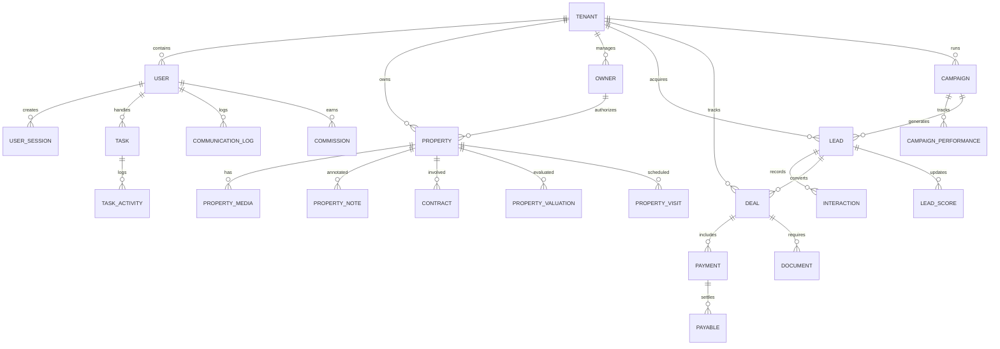
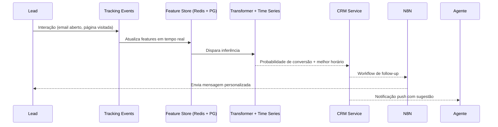

# ImobConvex — Blueprint Técnico Completo

> Documento inicial para implementação do Sistema Imobiliário Inteligente de Nova Geração. Abrange arquitetura, banco de dados, APIs, fluxos de IA, roadmap e estimativas. Atualize continuamente conforme decisões forem evoluindo.

## 1. Visão Geral da Solução

### 1.1 Objetivos Estratégicos
- Entregar uma plataforma premium com foco em simplicidade e automação inteligente.
- Aumentar em 40% a conversão de leads via IA e orquestração multicanal.
- Reduzir o tempo operacional dos corretores em pelo menos 5h/dia.
- Garantir desempenho (Lighthouse > 90) e governança (LGPD, auditoria, alta disponibilidade).

### 1.2 Componentes Principais
```mermaid
flowchart LR
    subgraph Client Apps
        PWA[Portal Imobiliário (Next.js PWA)]
        Mobile[App Corretor (React Native Expo)]
        Owner[Portal Proprietário (Next.js multi-tenant)]
    end

    subgraph Edge
        CDN[CDN + WAF]
        SEO[SEO/Static Edge Render]
    end

    subgraph Backend Cluster (AWS ECS Fargate)
        APIGW[API Gateway / BFF]
        Auth[Serviço de Autenticação]
        CRM[CRM & Funil]
        Inventory[Gestor de Imóveis]
        Finance[Gestão Financeira]
        Marketing[Marketing Automation]
        AIHub[Motor de IA & Orquestração]
        Integrations[Serviço de Integrações]
        Worker[Orquestrador de Jobs (Celery/RQ)]
    end

    subgraph Data Layer
        PG[(PostgreSQL 16 - RDS)]
        Redis[(Redis 7 Cluster - Cache/Queue)]
        Pinecone[(Vector DB - Pinecone)]
        S3[(Object Storage - AWS S3)]
        OpenSearch[(Logs & Analytics)]
    end

    subgraph External Services
        OpenAI
        Langsmith[LangSmith]
        TensorFlowHub[TF Serving]
        N8N[N8N Self-Hosted]
        Payments[Stripe/Mercado Pago/Pix]
        Messaging[Twilio/WhatsApp]
        Email[SendGrid]
        Maps[Google Maps Platform]
        Docs[Clicksign/D4Sign]
        Analytics[GA4/Hotjar/Mixpanel]
        WordPress[WP + JetEngine]
    end

    Client Apps --> CDN --> APIGW
    APIGW --> Auth
    APIGW --> CRM
    APIGW --> Inventory
    APIGW --> Finance
    APIGW --> Marketing
    APIGW --> AIHub
    AIHub -->|Embeddings/LLM| OpenAI
    AIHub -->|Workflows| Langsmith
    AIHub -->|Scoring| TensorFlowHub
    AIHub --> Pinecone
    CRM --> PG
    Inventory --> PG
    Finance --> PG
    Marketing --> PG
    Auth --> Redis
    APIGW --> Redis
    Worker --> Redis
    Worker --> PG
    Worker --> S3
    Integrations --> Messaging
    Integrations --> Email
    Integrations --> Payments
    Integrations --> Docs
    Marketing --> N8N
    Inventory --> Maps
    Analytics --> Client Apps
    WordPress --> Integrations
    WordPress --> APIGW
```

### 1.3 Migração Progressiva do WordPress + JetEngine
1. **Fase 1 — Análise (2 semanas):** inventário de CPTs, taxonomias, plugins e integrações críticas. Scripts de descoberta automatizada via WP REST.
2. **Fase 2 — Convivência (4 semanas):** API BFF expõe dados do novo core, enquanto WP continua front principal. Sincronização via webhooks e jobs noturnos.
3. **Fase 3 — Migração (3 semanas):** ETL incremental (Airflow ou Dagster) convertendo dados WP em tabelas normalizadas. Testes em staging com diff automatizado.
4. **Fase 4 — Go-Live (1 semana):** Cutover com feature flags, redirects 301 preservando SEO e monitoramento intensivo (Synthetics, GA4, Sentry).

> **Pendências:** preencher dados de prazo, orçamento, equipe e volumes quando disponíveis. Estes direcionam sizing de infraestrutura e priorização.

## 2. Arquitetura Lógica

| Domínio | Microserviço | Responsabilidades | Principais Tecnologias |
| --- | --- | --- | --- |
| Autenticação & Identidade | `auth-service` | SSO, JWT/refresh, MFA, gestão de permissões multi-tenant | FastAPI, OAuth2, Redis, PyOTP |
| CRM Inteligente | `crm-service` | Funil visual, scoring, timeline, comunicações integradas | FastAPI, SQLAlchemy, Celery, LangChain |
| Gestão de Imóveis | `inventory-service` | Cadastro inteligente, recomendação, mapas, versionamento | FastAPI, PostGIS, Google Maps API |
| Financeiro | `finance-service` | Contratos, repasses, faturamento, conciliação bancária | FastAPI, SQLAlchemy, Stripe SDK, Pix API |
| Marketing | `marketing-service` | Campanhas Ads, e-mail, A/B testing, ROI analytics | FastAPI, N8N, Mixpanel, SendGrid |
| IA & Orquestração | `ai-orchestrator` | Scoring, NLP, previsão, automações, assistentes | LangChain, OpenAI, TensorFlow Serving, Redis |
| BFF/GraphQL Gateway | `api-gateway` | Normaliza dados para frontends, caching, rate limiting | FastAPI (GraphQL via Strawberry), Redis, Kong |
| Observabilidade | `observability-stack` | Logs, métricas, tracing | OpenTelemetry, DataDog, Sentry, Grafana |

## 3. Banco de Dados (PostgreSQL + PostGIS)

### 3.1 Diagrama ER Simplificado


### 3.2 Principais Tabelas
- **tenant** `(id, name, slug, plan, settings_jsonb, created_at)`
- **user_account** `(id, tenant_id, role, status, name, email, hashed_password, mfa_secret, created_at, last_login_at)`
- **user_session** `(id, user_id, refresh_token, expires_at, device_fingerprint, created_at)`
- **lead** `(id, tenant_id, origin, name, email, phone, preferences_jsonb, score_current, status, assigned_to, source_campaign_id, last_interaction_at, created_at)`
- **lead_score_history** `(id, lead_id, model_version, score, probability_to_close, sentiment, factors_jsonb, created_at)`
- **property** `(id, tenant_id, owner_id, code, type, status, price, rental_price, bedrooms, bathrooms, suites, parking_spaces, area_total, area_usable, amenities_jsonb, geolocation geography(Point,4326), neighborhood, city, state, cep, description_richtext, created_at, updated_at)`
- **property_media** `(id, property_id, media_type, url, position, metadata_jsonb, created_at)`
- **property_version** `(id, property_id, version, diff_jsonb, created_by, created_at)`
- **property_visit** `(id, property_id, lead_id, agent_id, scheduled_at, check_in_at, check_out_at, feedback_text, rating, created_at)`
- **deal** `(id, tenant_id, lead_id, property_id, type, stage, value, commission_total, expected_close_at, closed_at, probability, funnel_position, created_by, created_at)`
- **contract** `(id, deal_id, contract_type, start_date, end_date, status, document_url, signed_at, signature_provider, created_at)`
- **payment** `(id, deal_id, tenant_id, amount, currency, due_date, paid_at, method, transaction_reference, status, created_at)`
- **payable** `(id, payment_id, beneficiary_type, beneficiary_id, amount, fee, commission_percentage, due_date, paid_at, created_at)`
- **campaign** `(id, tenant_id, channel, name, objective, budget, start_date, end_date, status, created_by, created_at)`
- **campaign_performance** `(id, campaign_id, date, impressions, clicks, ctr, conversions, cost, revenue, roi, created_at)`
- **task** `(id, tenant_id, title, description, due_at, status, priority, assigned_to, created_by, created_at)`
- **task_activity** `(id, task_id, actor_id, action, payload_jsonb, created_at)`
- **communication_log** `(id, tenant_id, lead_id, user_id, channel, direction, content, sentiment, ai_summary, created_at)`
- **document** `(id, tenant_id, deal_id, property_id, url, kind, status, provider, uploaded_by, created_at)`
- **audit_log** `(id, tenant_id, actor_id, entity, entity_id, action, diff_jsonb, ip_address, created_at)`

### 3.3 Armazenamento Complementar
- **Redis:** cache de queries, sessões, rate limiting, short-lived jobs.
- **Pinecone:** embeddings de descrições de imóveis, conversas, FAQs.
- **S3:** mídias, contratos, relatórios, backups criptografados.
- **TimeScaleDB Extension:** métricas temporais (campanhas, visitas, analytics).

## 4. Especificação de APIs

### 4.1 Padrões Gerais
- **Gateway GraphQL (BFF):** combina múltiplos serviços, fornece agregações otimizadas para front.
- **REST JSON para integrações externas:** versionado (`/api/v1`).
- **Autenticação:** OAuth2 + JWT curta duração (15 min) + refresh token rotativo.
- **Rate limiting:** 100 req/minuto por token padrão.
- **Resposta:** envoltório `{ data, meta, errors }` com correlação (`x-request-id`).

### 4.2 Exemplos de Endpoints REST

#### Leads
```
POST /api/v1/leads
Body: {
  "name": "Ana Souza",
  "email": "ana@email.com",
  "phone": "+55 11 99999-0000",
  "preferences": {
    "operation": "buy",
    "location": ["Vila Madalena", "Pinheiros"],
    "budget": { "min": 250000, "max": 350000 },
    "bedrooms": 2
  },
  "source": "landing-page-campanha-x"
}
Response 201: {
  "data": {
    "id": "lead_123",
    "score": 78,
    "status": "HOT",
    "recommendedProperties": ["prop_1", "prop_2", "prop_3"],
    "nextAction": "Enviar WhatsApp personalizado"
  }
}
```

```
GET /api/v1/leads/{id}
Response 200: {
  "data": {
    "id": "lead_123",
    "status": "HOT",
    "score": 82,
    "probabilityToClose": 0.74,
    "timeline": [ ... ],
    "recommendedActions": [ ... ]
  }
}
```

#### Propriedades
```
POST /api/v1/properties
Body: {
  "title": "Apartamento 2 quartos na Vila Madalena",
  "address": {
    "street": "Rua Girassol, 123",
    "city": "São Paulo",
    "state": "SP",
    "zip": "05433-000"
  },
  "geo": { "lat": -23.555, "lng": -46.692 },
  "pricing": { "sale": 320000, "condoFee": 550 },
  "features": {
    "bedrooms": 2,
    "bathrooms": 2,
    "parkingSpaces": 1,
    "amenities": ["Varanda", "Coworking", "Piscina"]
  },
  "media": [ { "url": "https://cdn/imovel1-01.webp", "type": "image" } ]
}
```

#### Financeiro
```
POST /api/v1/deals/{dealId}/payments
Body: {
  "amount": 4500,
  "dueDate": "2024-05-10",
  "method": "PIX",
  "split": [
    { "beneficiaryType": "CORRETOR", "beneficiaryId": "user_45", "amount": 1500 },
    { "beneficiaryType": "IMOBILIARIA", "amount": 3000 }
  ]
}
```

### 4.3 Schema GraphQL (trecho)
```graphql
type Lead {
  id: ID!
  name: String!
  email: String
  phone: String
  status: LeadStatus!
  score: Int!
  probabilityToClose: Float
  stage: String
  assignedTo: User
  recommendedProperties(limit: Int = 3): [Property!]!
  timeline(limit: Int = 50): [Interaction!]!
}

type Mutation {
  createLead(input: CreateLeadInput!): Lead!
  assignLead(leadId: ID!, userId: ID!): Lead!
  logInteraction(input: LogInteractionInput!): Interaction!
  generateProposal(dealId: ID!): Document!
}
```

## 5. Fluxos de IA e Automação

### 5.1 Qualificação Automática de Leads
```mermaid
flowchart TD
    A[Lead entra pelo Portal/Integração] --> B[Normalização de dados e enriquecimento (Clearbit/Serasa opcional)]
    B --> C[Extração de features comportamentais (páginas, tempo, CTA)]
    C --> D[Embeddings + Similaridade (Pinecone) para recomendação]
    D --> E[Modelo Scoring Ensemble (XGBoost + LLM Rationale)]
    E --> F{Score >= Threshold?}
    F -- Sim --> G[Classificar Quente/Morno/Frio]
    G --> H[Gerar plano de ação via LLM (LangChain Prompt Templates)]
    H --> I[Disparar automações: WhatsApp, Email, Tarefas]
    F -- Não --> J[Solicitar informações adicionais via Chatbot]
    J --> A
```

### 5.2 Sugestão de Follow-up Inteligente


### 5.3 Precificação Dinâmica de Imóveis
- Pipeline diário com dados públicos (FIPEZAP, IBGE, GeoJSON) + históricos internos.
- Modelo híbrido: regressão espacial (GeoGWR) + rede neural tabular (TensorFlow) + ajuste por LLM para narrativa.
- Alerts emitidos quando desvio > ±7% em relação ao mercado.

## 6. Stack Tecnológica Justificada

| Camada | Escolha | Justificativa |
| --- | --- | --- |
| Frontend Web | **Next.js 14 (App Router) + TypeScript + Tailwind/shadcn** | SSR/SSG para SEO, performance, design system consistente, suporte PWA.
| Mobile | **React Native (Expo)** | Reuso de componentes, entrega rápida de apps nativos, OTA updates.
| Backend | **FastAPI (Python 3.12)** | Alto desempenho async, typing rigoroso, integração natural com ML stack Python.
| Banco Relacional | **PostgreSQL 16 + PostGIS + Timescale** | Dados relacionais complexos, geolocalização, métricas temporais.
| Cache/Queue | **Redis 7 (Elasticache)** | Sessões, rate limiting, filas Celery/RQ.
| IA | **OpenAI GPT-4.1, LangChain, TensorFlow Serving, Pinecone** | Combina LLMs com modelos proprietários e vetorização eficiente.
| Automação | **N8N self-hosted** | Criação rápida de fluxos sem acoplamento ao core.
| Observabilidade | **OpenTelemetry + DataDog + Sentry** | Monitoração de ponta a ponta, rastreamento distribuído.
| Infra | **AWS (ECS Fargate, RDS, S3, CloudFront) + Vercel para edge)** | Escalabilidade, IaC via Terraform, PWA edge deploy.
| CI/CD | **GitHub Actions + ArgoCD (k8s opcional)** | Pipelines consistentes, políticas de aprovação.
| Segurança | **Auth0 opcional / Keycloak self-hosted** | Delegação de identidade, MFA, compliance LGPD.

## 7. Roadmap de Implementação (Sprints de 2 semanas)

| Sprint | Objetivos Principais | Entregáveis |
| --- | --- | --- |
| **0 - Discovery (opcional)** | Refinar requisitos, personas, métricas. | User journeys, backlog priorizado, definição de OKRs. |
| **1 - MVP Core** | Setup DevOps, boilerplate Front/Back, CRM básico, cadastro imóveis, portal público. | Autenticação básica, CRUD leads/propriedades, listagem pública com busca e mapa inicial, migração parcial WP (leads). |
| **2 - Automação & IA** | Scoring inicial, automações simples, IA para descrições e chat. | Modelo scoring v0, integrações WhatsApp/Email, chat bot público, tasks automatizadas. |
| **3 - Financeiro & Relatórios** | Fluxos de contratos, pagamentos, dashboards executivos. | Gestão de contratos, geração de boletos/PIX, relatórios DRE, dashboards PowerBI/Mixpanel. |
| **4 - Marketing & Integrações** | Campanhas, landing pages, analytics avançado. | Conectores Facebook/Google Ads, N8N workflows, heatmaps, blog headless. |
| **5 - Performance & Go-Live** | Hardening, testes, migração full. | Testes carga/segurança, otimizações Lighthouse, feature flags, treinamento, planos de suporte. |

> Ajuste de escopo conforme dados de volume, equipe e orçamento forem definidos.

## 8. Wireframes (low fidelity)

### 9.1 Portal Imobiliário — Home
- Hero com busca principal (localização, faixa de preço, finalidade).
- Grid de destaques + mapa interativo lado a lado (desktop) ou tabs (mobile).
- Cards com foto, preço, badges (novo, destaque, 360°).
- Barra fixa de filtros avançados com colapsos.

### 9.2 CRM — Funil de Vendas
- Kanban com colunas (Novo, Contato feito, Visita agendada, Proposta, Fechado).
- Card do lead: foto, score, valor potencial, ação recomendada.
- Sidebar à direita com timeline e botões de comunicação rápida.

### 9.3 Dashboard Corretor
- Topo: metas do mês, com progress bar (Zeigarnik).
- Cards: leads atribuídos, visitas hoje, tarefas urgentes.
- Lista: próximos follow-ups com etiqueta de horário sugerido.

> Recomenda-se evoluir wireframes no Figma compartilhado. Anexar screenshots quando disponíveis.

## 9. Segurança e Conformidade
- LGPD: consentimento explícito, direito ao esquecimento, registros de processamento.
- Autenticação: JWT + refresh rotativo, MFA opcional (TOTP/SMS), políticas de senha.
- Criptografia: TLS 1.3 end-to-end, dados sensíveis em repouso (KMS), hashing Bcrypt.
- Auditoria: trilhas completas (audit_log), alertas DataDog para ações suspeitas.
- Proteções API: rate limiting, WAF, validação de entrada (Pydantic), sanitização HTML.
- Backups: snapshots RDS diários, S3 versionado, testes de restauração trimestrais.

## 10. Próximos Passos
1. Validar estimativas com stakeholders e preencher dados pendentes (prazo, orçamento, equipe, volume).
2. Priorizar integrações críticas e confirmar fornecedores (WhatsApp, pagamentos, assinatura eletrônica).
3. Iniciar Sprint 0 com discovery detalhado e prototipagem de UX no Figma.
4. Configurar repositórios monorepo (Turborepo) ou polyrepo conforme governança definida.
5. Implementar pipelines CI/CD base e infraestrutura IaC (Terraform) antes do desenvolvimento funcional.

---
**Responsável:** Engenharia de Plataforma — versão 2024-04-XX (atualizar ao revisar).
